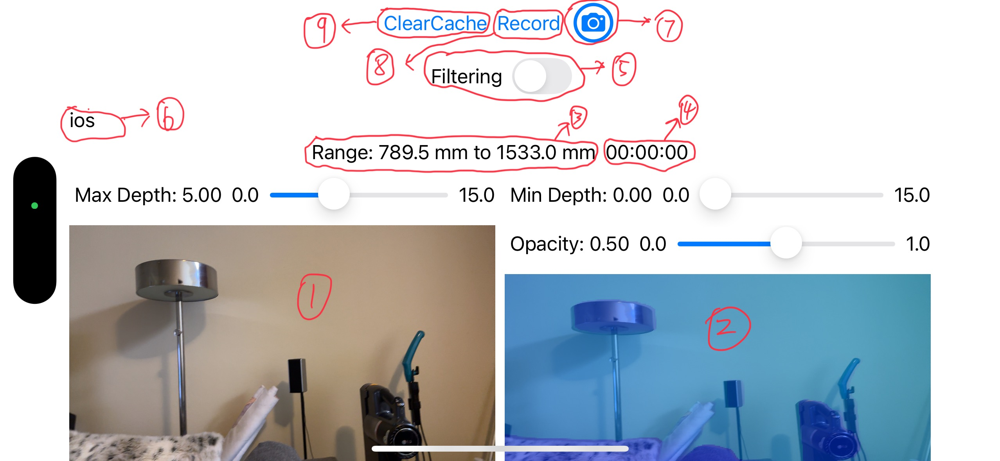

# Scoop: Mitigation of Recapture Attacks on Provenance-Based Media Authentication

:paperclip: [Scoop Paper]()  
:camera: [Scoop iOS Camera](https://github.com/trusslab/scoop_camera_ios)  
:camera: [Scoop Android Camera](https://github.com/trusslab/scoop_camera_android)  
:computer: [Scoop Viewer](https://github.com/trusslab/scoop)  
:floppy_disk: [Scoop Dataset](https://doi.org/10.5281/zenodo.15611905)

## Overview

This is a part of the Scoop project, which provides an iOS application that can capture photos and videos with depth data using the LiDAR camera. 
This is modified on top of the sample code provided by Apple in the [Capturing Depth Using the LiDAR Camera](https://developer.apple.com/documentation/avfoundation/capturing-depth-using-the-lidar-camera).

By default, the app captures photos and videos in JPEG and H.264(MP4 without audio) formats, respectively.
RGB resolution for both photos and videos is set to 3840x2160 (4K) and depth resolution for photos is set to 768x432 and for videos is set to 320x180. 
For videos, the app captures at 30 frames per second (FPS) and for photos, it captures a single frame.
For videos, the depth data capture process is synchronized with the RGB capture process, ensuring that the depth data corresponds to the captured media.
The depth data is captured in a custom format with the `.idep` extension, which is designed to be used with the Scoop viewer.

## Requirements
An iOS device that provides a LiDAR camera, such as:
- iPhone 12 Pro or later
- iPad Pro 11-inch (3rd generation) or later
- iPad Pro 12.9-inch (5th generation) or later

This app has been tested on a iPhone 14 Pro running iOS 18.5.

## Usage

1. Open the project in Xcode.
2. Connect your iOS device to your computer.
3. Select your device as the target in Xcode.
4. Build and run the app on your device.
5. Grant the necessary permissions for camera and depth data access when prompted.
6. Use the app to capture photos and videos with depth data.
7. The captured media and its depth data will be saved to the App's internal storage.
8. You can access the captured media and depth data by downloading it from the device using Xcode.

For more information on how to build and run iOS apps, refer to the [Xcode documentation](https://developer.apple.com/documentation/xcode/building-and-running-an-app).

## App's Interface

Screenshot of the App's interface is shown below:

1. Preview of the main camera.
2. Preview of the main camera with depth data overlay.
3. Current detected depth range.
4. Recording timer.
5. Enable/disable filtering of depth data (which automatically calculates missing depth values).
6. Captured media file name. (Note that for photos, the final file name will be FILE_NAME_photo.jpg, and for videos, it will be FILE_NAME_video.mp4)
7. Photo capture button. Note that there is a 4 seconds delay after pressing the button to capture a photo.
   This is to ensure that the photographer has enough time to set up the camera and frame the shot before the photo is captured.
   After the photo is captured, the app will display a preview of the captured photo. 
   By clicking on the preview, the app will resume the live camera preview.
8. Video capture button.
9. Clear/delete existing captured media button. (Note that this can also be used to check what media files are currently stored in the app's internal storage)

## Download Captured Media and Depth Data

To download the captured media and its depth data from the app's internal storage, you will need to download the entire app's container directory.
1. Connect your iOS device to your computer.
2. Open Xcode and go to the "Window" menu.
3. Select "Devices and Simulators".
4. Select your device from the list.
5. Under the "Installed Apps" section, find the Scoop app.
6. Click on the gear icon next to the app and select "Download Container".
7. Choose a location to save the container file.
8. Once the download is complete, navigate to the downloaded container file.
9. Inside the container, you will find the captured media files in the `AppData/Documents` directory.
10. The media files will be named according to the format specified in the app (e.g., `FILE_NAME_photo.jpg` for photos and `FILE_NAME_video.mp4` for videos).
11. The depth data files will be in the same directory with similar names (i.e., `FILE_NAME_photo_depth.idep` for photos and `FILE_NAME_video_depth.idep` for videos) as the media files but with a `.idep` extension.

## License
This project is licensed under the MIT License. See the [LICENSE](./LICENSE) file for details.